# Задание 1. Планирование

## Схема системы с примененеием шардирования

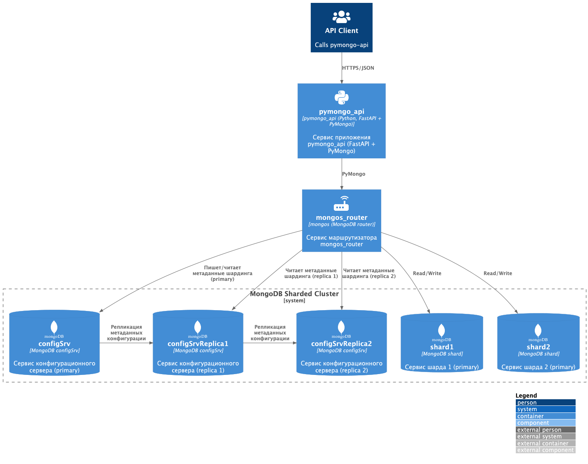

## Схема системы с примененеием шардирования и репликации

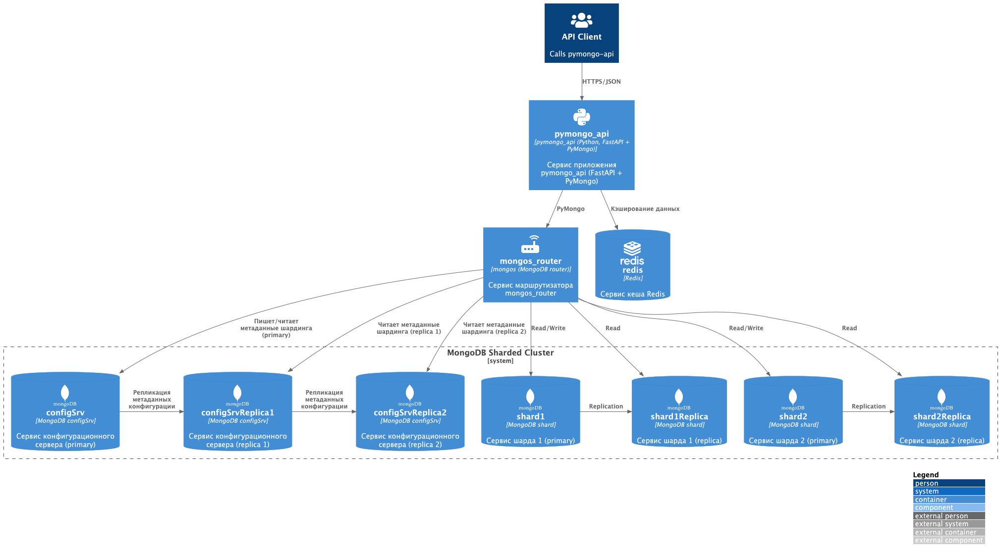

## Схема системы с примененеием шардирования, репликации и кеширования запросов через redis

**Замечание**: схема отображает cluster из Redis, в то время как текущая реализация в задании 4 будет содержать только один инстанс.

Изначально мною был модифицирован `api_app` (`pymongo_api`) чтобы поддержать кластер, и система была настроена и работала с кластером. Позже из-за требования упомянутого в конце задания об использовании образа `kazhem/pymongo_api:1.0.0` - пришлось убрать кластеры redis в реализации.

Как результат во всех схемах упоминаются кластеры, в то время как на самом деле используется только один инстанс redis_1

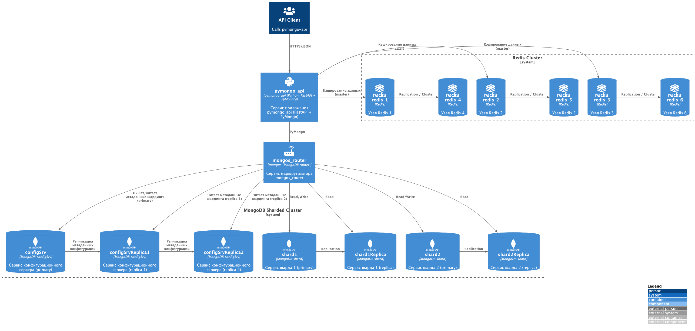

# Задание 2. Шардирование

Как запустить и проверить проект задания - [README.md](mongo-sharding/README.md) 

Натройка по инструкции должна выполняться без ошибок - проект запускается

## Результат выполнения `docker compose ps`

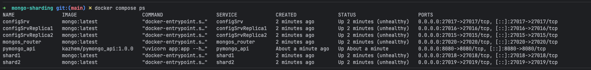

## Результат вывода браузера

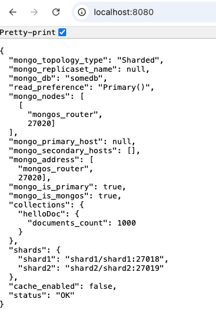

# Задание 3. Репликация

Как запустить и проверить проект задания - [README.md](mongo-sharding-repl/README.md)

Натройка по инструкции должна выполняться без ошибок - проект запускается

## Результат выполнения `docker compose ps`

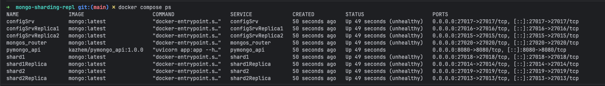

## Результат вывода браузера

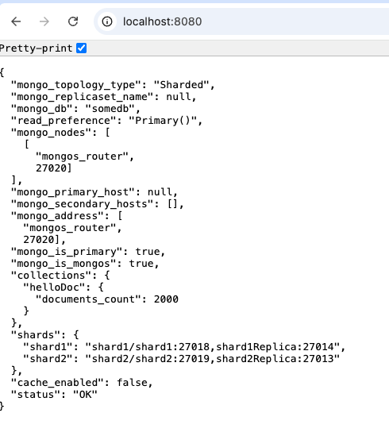

# Задание 4. Кеширование

Как запустить и проверить проект задания - [README.md](mongo-sharding-cache/README.md)

Натройка по инструкции должна выполняться без ошибок - проект запускается

## Результат выполнения `docker compose ps`

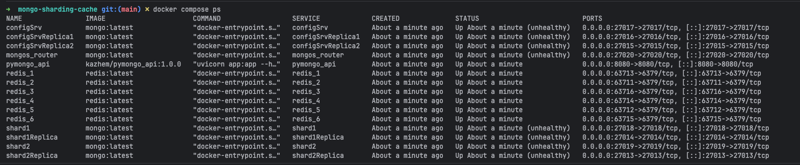

## Результат вывода браузера

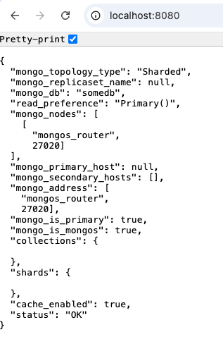

### Результат выполнения первого запроса `/helloDoc/users `

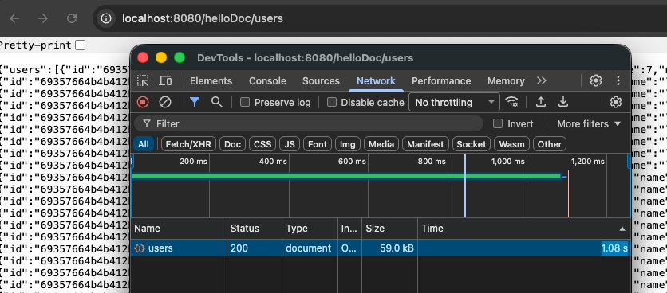

### Результат выполнения второго запроса `/helloDoc/users `

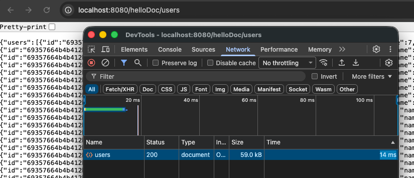

# Задание 5. Service Discovery и балансировка с API Gateway

Реализованная схема:

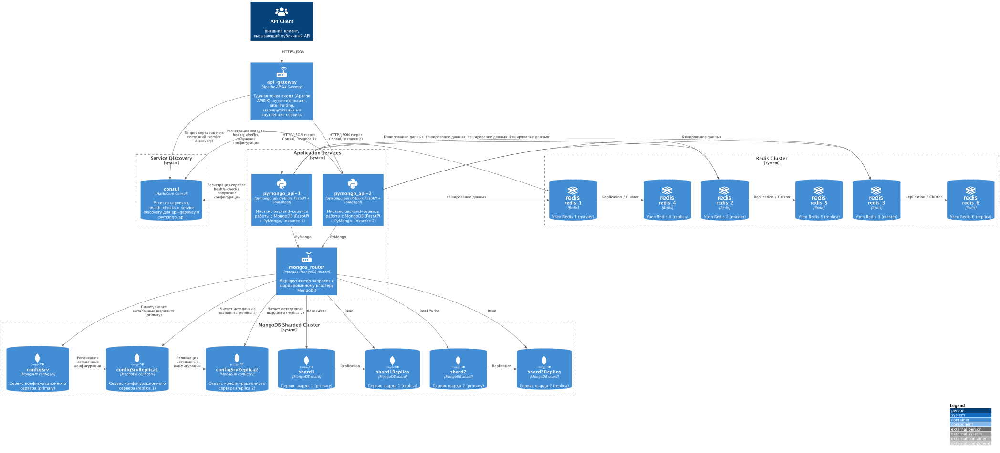

# Задание 6. CDN

Реализованная схема:

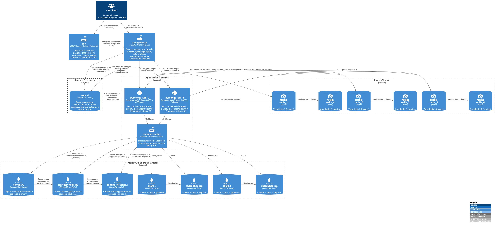

# Задание 7. Проектирование схем коллекций для шардирования данных

Архитектурный документ - [ADR_db_schema.md](ADR_db_schema.md)

# Задание 8. Выявление и устранение «горячих» шардов

Архитектурный документ - [ADR_shard_monitoring.md](ADR_shard_monitoring.md)

# Задание 9. Настройка чтения с реплик и консистентность

Архитектурный документ - [ADR_replication.md](ADR_replication.md)

# Задание 10. Миграция на Cassandra: модель данных, стратегии репликации и шардирования

Архитектурный документ - [ADR_cassandra.md](ADR_cassandra.md)
